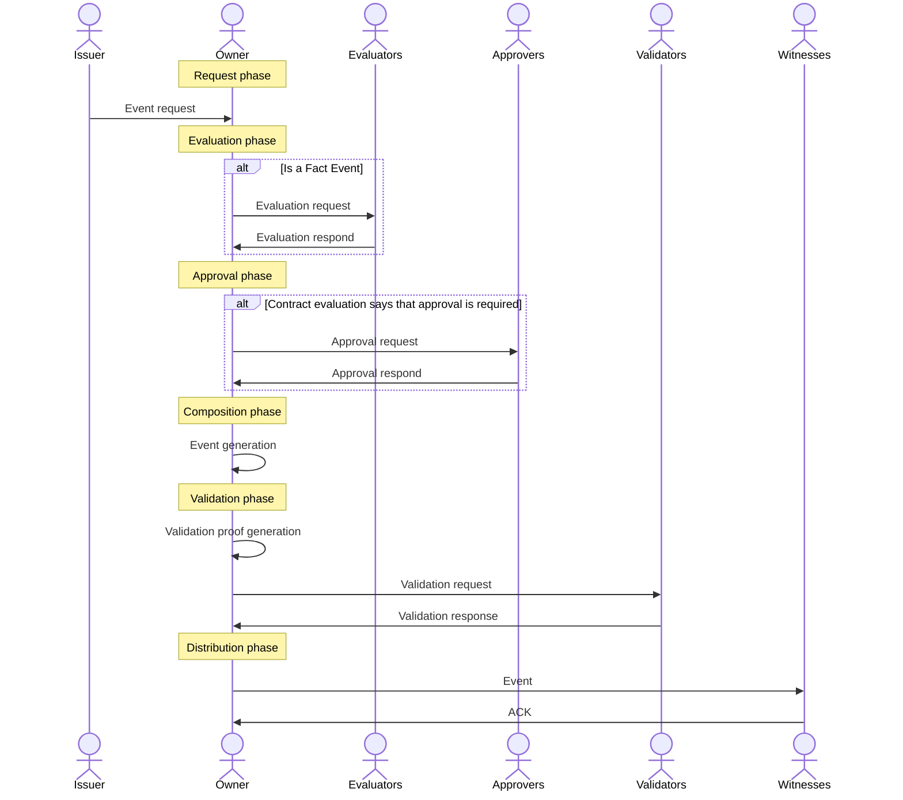

Events are the data structures that represent the facts to be tracked during the life of a subject. These structures constitute the **micrologger**, i.e. the chain of events.

Each event is composed of the following:

- The request that generated the event.
- The cryptographic fingerprint of the previous event to form the chain.
- A set of meta-information related to the topic and the event.
- A set of different signatures that are added as the event progresses through its lifecycle.

## Life cycle

The **governance** determines the process by which events are incorporated into the life cycle of the traceability subject.
The event lifecycle is composed of 6 stages, from its request for generation to its distribution.




### 1. Request 
To change the state of a subject it is necessary to add an event to its micro-ledger. To do this, the first step is to generate an event request . In Kore only the owner of the subject can generate events on the subject. However, these events can be generated by requests from other participants, known as **issuers** . In this way, the owner acts as the organizer of event requests, which can be generated by himself or by other participants.

As the only one who can enter events in the micro-logger, the owner has the final say on whether or not to create an event from a request, even if it is sent by another participant. In situations where it is necessary to ensure that the request has been logged, additional security measures to those offered by Kore must be implemented.

Event requests contain the following:

- The type of event to generate.
- The information to be included in the **microledger**, e.g., to modify the subject status.
- The signature of the sender, which may be the owner of the subject or another participant with sufficient permissions.

### 2. Evaluation
In Kore there are different types of events and not all of them share the same life cycle. In the case of **fact events** there are 2 additional steps: evaluation and approval.

The evaluation phase corresponds to the execution of the **contract**. For this, the subject holder sends the following information to the evaluators:

- the current status of the subject, since the evaluators do not need to witness it, and therefore may not know its status;
- the subject's metadata, such as its schema and namespace.

After receiving the information, the evaluator executes the **contract** and returns the modified subject state to the subject owner, the need or not for approval and his signature. The owner must collect as many evaluator signatures as governance dictates.

### 3.  Approval
The evaluation of some contracts may determine that the result, even if properly executed, requires approval. This means that, in order to be accepted by the other participants, it is necessary to include a number of additional signatures from other participants, the approvers. These approvers sign for or against an event request. The rules defined in the governance indicate which signatures are necessary for an event request to be approved and, therefore, for an event to be generated from this request.

The decision to approve or disapprove a request may depend on the participation of an individual or it may depend on some IT system, such as a business intelligence process.

### 4. Generation
The next step is the actual generation of the event. The event is composed including the request, the contract evaluation, the signatures of the evaluators and approvers, the hash of the previous event and a series of metadata associated with the event. The event is then signed with the subject cryptographic material, which ensures that only the owner of the subject was able to generate the event.

### 5. Validation
A generated event cannot be distributed directly. The reason is that the other participants in the network have no guarantee that the owner has not generated different versions of the event and distributed them according to his own interests. To avoid this, the validation phase arises. Several network participants, the validators, provide their signature to the event, guaranteeing that a single event exists. Not all subjects require the signatures of the same validators. Governance defines which participants must provide their signatures and how many signatures are required. The number of signatures will depend on the use case and the network's trust in the members acting as validators.

### 6. Distribution
Once there are enough validation signatures, the event is complete and can be distributed to the rest of the network participants. The owner sends the event along with the validation signatures to the tokens. The witnesses, once the validity of the set has been verified, will incorporate the event into the **microledger**, and will delete the validation signatures they had stored for the previous event.

## Types of events
| Event | Description |
|-----------|-----------------------------------------------------------------------------------------------------------|
| Start | Initializes the event log of a subject, establishing the participants and the **governance** of the ledger. |
| State | State records change the subject's properties, so its state is modified.             |
| Fact | Events related to the subject's function or environment but which do not change its properties.         |
| Transfer | Transfers ownership of the subject to a new owner. A key rotation occurs to prevent manipulation of previous events by the new owner. |
| EOL | End-of-life event that terminates event registration, preventing new additions.                     |

As for the structure and contents of the events, we have relied on industry-recognized design solutions [^1]. The usual approach is to structure the event in a header, with a common structure for all events, including their metadata, and a payload with specific information for each event.

## Example
Diagram generated an event type **Fact**.

## Referencias
[^1]: Event Processing in Action - Opher Etzion y Peter Niblett (2010). Manning Publications Co., 3 Lewis Street Greenwich, Estados Unidos. ISBN: 978-1-935182-21-4.