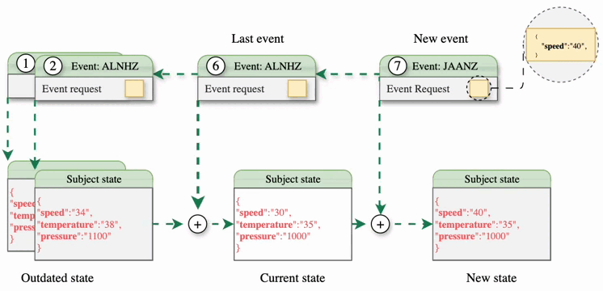

Instead of having a single ledger shared by all participants, the information is structured subject by subject. Subjects are logical entities that represent an asset or process within a network.

Each subject complies with the following:
- It contains a single [microledger](#microledger).
- It has a [state](#subject-state) modeled by a schema.
- It has a single [owner](#ownership-model).
- Depends on a [governance](#belonging-to-a-governance).

## Microledger
Each subject internally contains a ledger in which events affecting only that subject are recorded, the **microledger**. This **microledger** is a set of events chained together using cryptographic mechanisms. It is similar to a blockchain in that the different elements of the chain are related including the cryptographic fingerprint of the immediately preceding element, but, unlike blockchains where each block may include a set of transactions, possibly from different accounts, in the **microledger**. each element represents a single event of the subject itself.

{}
{}

## Subject State
The state is the representation of the information stored by a subject at a given instant, usually the current time. The state is obtained by applying, one after the other, the different events of the **microledger** on the initial state of the subject defined in its **event-genesis**. 

The state structure must correspond to a valid schema. For more information about schemas, please visit the [Schemas](../schema).

 Unlike other DLTs, Kore has no data tables. The information is stored in a single entity, the subject state. This entity should represent only the final state of our subject, while the details of the different events will be stored in the microledger.

## Ownership model
Any subject has a single owner, this being the only participant in the network that can make effective modifications on the subject, i.e., add events in the **microledger**. However, other participants, the senders, can generate event requests. These event requests are signed by the sender and sent to the subject owner.

## Belonging to a governance
A subject always exists within a use case. Governance is the definition of the rules by which the use case is governed. What types of subjects can be created or who can create them are some of the rules that are defined in governance. Although a subject can only belong to one governance, a node can manage subjects of different governance, so that the same node can participate simultaneously in different use cases.

### Namespace 
When a subject is created, certain information is associated with it, such as governance, schema and a namespace. The namespace is associated with the use case and governance, as it is the mechanism by which stakeholders can be segmented. In the same use case, not all participants may be interested in all subjects, but only in a subset of them.

## Subject identifier and keys
Each subject, at the time of its creation, is assigned a pair of cryptographic keys with which to sign the events of its microledger. From the public key and other metadata, its **Subject Identifier** (subjectId) , which uniquely represents it in the network, is generated.