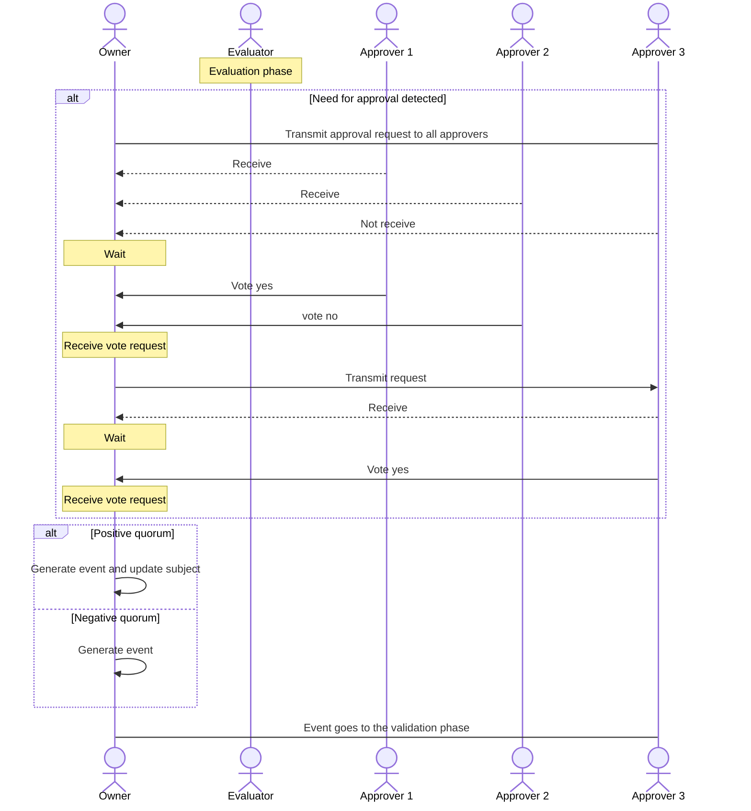

La fase de aprobación consiste en pedir a los aprobadores que voten a favor o en contra de la aplicación de un evento. Este proceso puede automatizarse, pero tiende a ser manual. La respuesta requiere interacción con la API de Kore si está configurada como manual, por lo que requiere un usuario que pueda interactuar con ella y, por lo tanto, suele llevar más tiempo que las otras fases.

Los aprobadores están definidos por la gobernanza, por lo que deben poseerlo para realizar la evaluación, de lo contrario no tendrían acceso al **contrato**, que a su vez se almacena en el estado del gobierno.

Los aprobadores sólo realizarán la evaluación si la versión de la gobernanza que posee el propietario del sujeto coincide con la del aprobador. Si es inferior o superior, se envía al propietario del sujeto un mensaje adecuado a cada caso.

El proceso de aprobación consta de los siguientes pasos:

- El propietario del sujeto verifica si la solicitud de evento requiere aprobación observando la respuesta de los evaluadores.
- Si la solicitud lo requiere, se envía una solicitud de aprobación a los diferentes aprobadores.
- Una vez que cada aprobador tenga la solicitud, podrá votar, tanto a favor como en contra, y la enviará de vuelta al propietario del sujeto.
- Cada vez que el titular reciba un voto comprobará lo siguiente:
  - Hay suficientes votos positivos para que la solicitud sea aceptada.
  - Hay tantos votos negativos que es imposible que se apruebe la solicitud.
En ambos casos, el propietario generará un evento. En el caso de que la votación no haya sido exitosa, se generará el evento pero no producirá cambios en el estado del sujeto, quedando con fines meramente informativos.

Es importante recordar que el propietario del sujeto es el único que puede forzar un cambio efectivo en un sujeto. Por tanto, el propietario, tras el proceso de aprobación, podría decidir si incluye o no el evento en la cadena. Esto no seguiría el comportamiento estándar definido por Kore, pero no rompería la compatibilidad.

