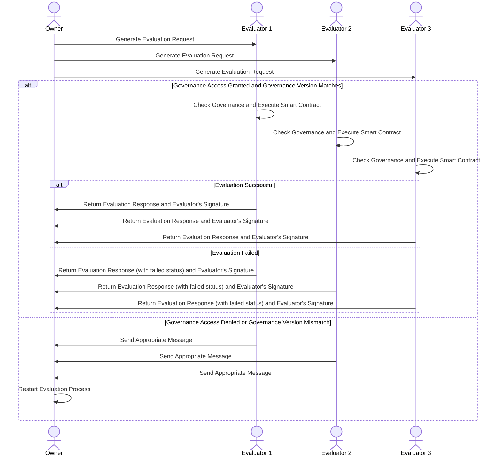

La fase de evaluación consiste en que el propietario del sujeto envía una solicitud de evaluación a los evaluadores, justo después de que el emisor generó una solicitud de evento con el tipo de evento y su contenido. Actualmente, la evaluación sólo está presente en eventos de tipo Fact, en los otros tipos se omite. Estos acontecimientos afectan a un determinado sujeto para establecer un Fact que puede modificar o no el estado del sujeto. También se envía un contexto que contiene la información necesaria para que los evaluadores ejecuten el **contrato** que contiene la lógica de evaluación de nuestro sujeto, como el estado anterior, si el emisor es el propietario del sujeto, etc. Este es el caso porque los evaluadores no necesariamente tienen una copia del sujeto, por lo que necesitan estos datos, que incluyen todo lo necesario para la ejecución del contrato.

Los evaluadores están definidos en la gobernanza, por lo que deben poseerlo para poder realizar la evaluación, de lo contrario no tendrían acceso al contrato, que a su vez se almacena en el estado del gobierno.

El resultado de aplicar el evento al sujeto en términos de modificación de propiedad lo realizan los evaluadores. Tienen la capacidad de compilar y ejecutar contratos compilados en WebAssembly.

La solicitud de evento de Fact contiene la información necesaria para ejecutar una de las funciones del contrato (o no, en cuyo caso se produce una evaluación fallida y se notifica al propietario del sujeto). La respuesta incluye si la evaluación fue exitosa o fallida, si es necesario pasar por la fase de aprobación y el JSON patch que, aplicado al estado del sujeto, producirá el cambio de estado, así como el hash del estado actualizado.

La respuesta de los evaluadores es firmada por ellos para que los testigos puedan verificar que se ha alcanzado el quórum en la fase de evaluación y que han firmado los evaluadores correctos.

Los evaluadores sólo realizarán la evaluación si la versión de la gobernanza que tiene el propietario del sujeto coincide con la del evaluador. Si es inferior o superior, se envía un mensaje adecuado a cada caso al propietario del sujeto.

Para los emisores, cuando se actualiza la gobernanza al que está asignado el sujeto, se debe reiniciar el proceso desde el inicio de la evaluación, ya sea que aún se encontrara en la fase de evaluación o ya en la fase de aprobación. Esto se debe a que los eventos deben evaluarse/aprobarse con la última versión de gobernanza disponible.

