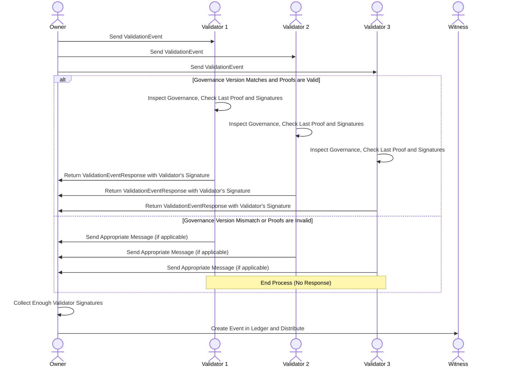

El proceso de validación es el último paso antes de lograr un evento válido que pueda incorporarse a la cadena del sujeto. El objetivo de esta fase es asegurar la unicidad de la cadena del sujeto. Se basa en la recogida de firmas de los validadores, que están definidas en la gobernanza. No produce un cambio en el evento en sí, ya que las firmas no están incluidas en el evento, pero son necesarias para validarlo ante los ojos de los testigos. Cabe señalar que para que la unicidad de la cadena sea plenamente efectiva, el quórum de validación debe estar formado por la mayoría de validadores. Esto se debe a que de no ser así se podrían validar varias cadenas con validadores diferentes para cada una si la suma del porcentaje de firmas para todos los quórumes no supera el 100%.

## Prueba de validación
Lo que firman los validadores se llama prueba de validación, el evento en sí no está firmado directamente. Esto se hace para garantizar la privacidad de los datos del evento y al mismo tiempo agregar información adicional que permita que el proceso de validación sea más seguro. A su vez, cuando los propietarios de los sujetos envían la prueba a los validadores, ésta también es firmada con el material criptográfico del sujeto. Tiene esta forma:

```rust
pub struct ValidationProof {
    /// El identificador del sujeto que está siendo validado.
    pub subject_id: DigestIdentifier,
    /// El identificador del esquema utilizado para validar el sujeto.
    pub schema_id: String,
    /// El espacio de nombres del sujeto que está siendo validado.
    pub namespace: String,
    /// El nombre del sujeto que está siendo validado.
    pub name: String,
    /// El identificador de la clave pública del sujeto que está siendo validado.
    pub subject_public_key: KeyIdentifier,
    /// El identificador del contrato de gobernanza asociado con el sujeto que está siendo validado.
    pub governance_id: DigestIdentifier,
    /// La versión del contrato de gobernanza que creó el sujeto que está siendo validado.
    pub genesis_governance_version: u64,
    /// El número de secuencia del sujeto que está siendo validado.
    pub sn: u64,
    /// El identificador del evento previo en la cadena de validación.
    pub prev_event_hash: DigestIdentifier,
    /// El identificador del evento actual en la cadena de validación.
    pub event_hash: DigestIdentifier,
    /// La versión del contrato de gobernanza utilizado para validar el sujeto.
    pub governance_version: u64,
}
```

Datos como la versión de la gobernanza(que denominaremos **sn**), que se usa para verificar que el voto solo debe devolverse si coincide con la versión de la gobernanza del sujeto para el validador, y la clave_pública(que denominaremos **subject_id**) es la que se usa para validar la firma del propietario de la próxima prueba de validación que llegue al validador.

Si el validador tiene la prueba anterior, puede validar ciertos aspectos, como que el **prev_event_hash** del nuevo coincida con el **event_hash** del anterior. La base de datos de los validadores siempre almacenará la última prueba que firmaron para cada sujeto. Esto les permite nunca firmar dos pruebas para el mismo **suject_id** y **sn** pero con otros datos diferentes (excepto la **sn**). Esto garantiza la unicidad de la cadena. La capacidad de cambiar la versión de la gobernanza se debe a lo que discutimos anteriormente: si un validador recibe una prueba con una versión de gobernanza diferente a la suya, no debe firmarla. Por lo tanto, ante actualizaciones de la gobernanza en medio de un proceso de validación, el propietario deberá reiniciar dicho proceso, adaptando la versión de la gobernanza de la prueba a la nueva.

Otro punto interesante es el caso en el que los validadores no cuentan con la prueba anterior para validar la nueva. No existe un escenario donde los validadores siempre tengan la prueba anterior, ya que incluso cuando el quórum requiere el 100% de las firmas, si un cambio de gobernanza agrega un nuevo validador, no tendrá la prueba anterior. Es por esto que cuando se solicita una validación se debe enviar:

```rust
pub struct ValidationEvent {
    pub proof: ValidationProof,
    pub subject_signature: Signature,
    pub previous_proof: Option<ValidationProof>,
    pub prev_event_validation_signatures: HashSet<Signature>,
}
```

La prueba anterior es opcional porque no existe en el caso del evento 0. El hashset de firmas incluye todas las firmas de los validadores que permiten que la prueba anterior haya alcanzado el quórum. Con estos datos, el validador puede confiar en la prueba previa que se le envía si no la dispone previamente.

La comunicación para solicitar validación y enviar validación es directa entre el propietario y el validador y se realiza de forma asíncrona.

## Cadena correcta
Como mencionamos anteriormente, la fase de validación se centra en lograr una cadena única, pero no en si esta cadena es correcta. Esta responsabilidad recae en última instancia en los testigos, que son los interesados ​​del sujeto. Los validadores no necesitan tener la cadena actualizada del sujeto para validar la siguiente prueba, ya que las pruebas son autocontenidas y como máximo requieren información de la prueba anterior. Pero nada impide que un propietario malicioso envíe datos erróneos en la prueba, los validadores no se darán cuenta porque no tienen el contexto necesario y firmarán como si todo estuviera correcto. Los testigos, sin embargo, sí tienen el sujeto actualizado, por lo que pueden detectar este tipo de engaños. Si algo así sucediera, los testigos son los encargados de denunciarlo y el sujeto sería bloqueado.

## Sequence Diagram
