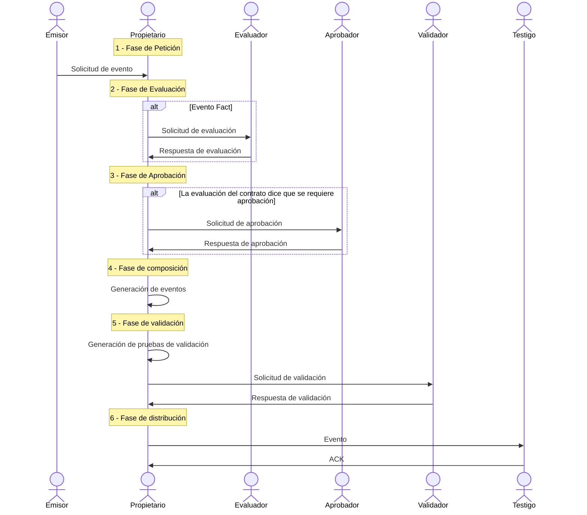
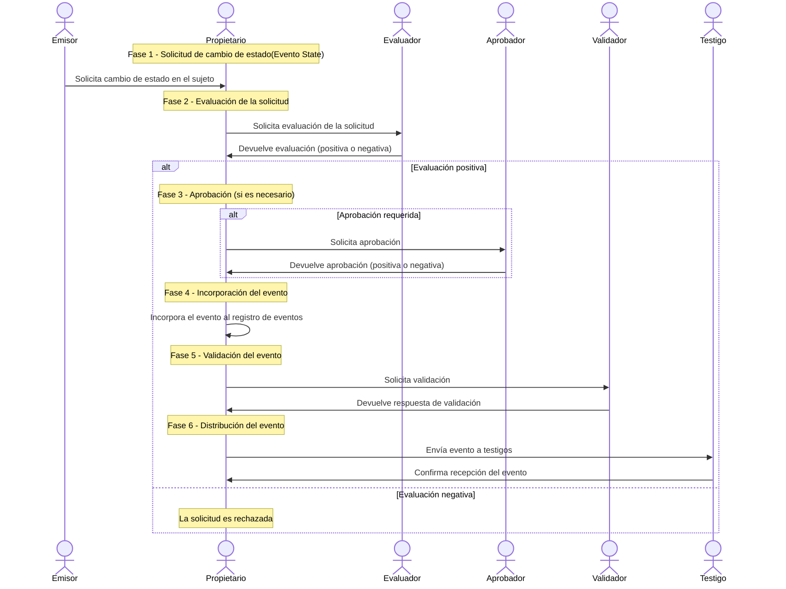

Los eventos son las estructuras de datos que representan los hechos que se deben rastrear durante la vida de un sujeto. Estas estructuras constituyen el **micrologger**, es decir, la cadena de acontecimientos.

Cada evento se compone de lo siguiente:

- La solicitud que generó el evento.
- La huella criptográfica del evento anterior para formar la cadena.
- Una serie de metainformación relacionada con el sujeto y el evento.
- Un grupo de firmas diferentes que se agregan a medida que el evento avanza en su ciclo de vida.

## Ciclo de vida

La **gobernanza** determina el procolo por el que los eventos son incorporados al ciclo de vida del sujeto de trazabilidad.
El ciclo de vida del evento se compone de 6 etapas, desde su solicitud de generación hasta su distribución.

{}
{}

### 1. Solicitud 
Para cambiar el estado de un sujeto es necesario agregar un evento a su microledger. Para ello, el primer paso es generar una solicitud de evento . En Kore sólo el propietario del sujeto puede generar eventos sobre el mismo . Sin embargo, estos eventos pueden generarse por solicitudes de otros participantes, conocidos como **emisores** . De esta forma, el titular actúa como organizador de las solicitudes de eventos, que pueden ser generadas por él mismo o por otros participantes.

Al ser el único que puede ingresar eventos en el microledger, el propietario tiene la última palabra sobre si crear o no un evento a partir de una solicitud, incluso si lo envía otro participante. En situaciones en las que sea necesario garantizar que la solicitud ha sido registrada, se deben implementar medidas de seguridad adicionales a las ofrecidas por Kore.

Las solicitudes de eventos contienen lo siguiente:

- El tipo de evento a generar.
- La información a incluir en el **microledger**, por ejemplo, para modificar el estado del sujeto.
- La firma del emisor, que puede ser el propietario del sujeto u otro participante con permisos suficientes.

### 2. Evaluación
En Kore existen diferentes tipos de eventos y no todos comparten el mismo ciclo de vida. En el caso de los **eventos Fact** existen 2 pasos adicionales: evaluación y aprobación.

La fase de evaluación corresponde a la ejecución del **contrato**. Para ello, el titular del sujeto envía la siguiente información a los evaluadores:

- el estado actual del sujeto, ya que los evaluadores no necesitan presenciarla, y por lo tanto pueden no conocer su estado;
- los metadatos del sujeto, como su esquema y espacio de nombres.

Después de recibir la información, el evaluador ejecuta el **contrato** y devuelve el estado del sujeto modificado al propietario del sujeto, la necesidad o no de aprobación y su firma. El propietario debe recoger tantas firmas de evaluadores como dicta la gobernanza.

### 3. Aprobación
La evaluación de algunos contratos puede determinar que el resultado, incluso si se ejecuta correctamente, requiere aprobación. Esto significa que, para ser aceptado por los demás participantes, es necesario incluir una serie de firmas adicionales de otros participantes, los aprobadores. Estos aprobadores firman a favor o en contra de una solicitud de evento. Las reglas definidas en la gobernanza indican qué firmas son necesarias para que una petición de evento sea aprobada y, por tanto, para que se genere un evento a partir de esta solicitud.

La decisión de aprobar o no una solicitud puede depender de la participación de un individuo o puede depender de algún sistema de TI, como un proceso de inteligencia empresarial.

### 4. Generación
El siguiente paso es la generación efectiva del evento. El evento se compone incluyendo la solicitud, la evaluación del contrato, las firmas de los evaluadores y aprobadores, el hash del evento anterior y una serie de metadatos asociados al evento. Luego, el evento se firma con el material criptográfico del sujeto, lo que garantiza que solo el propietario del sujeto pudo generar el evento.

### 5. Validación
Un evento generado no se puede distribuir directamente. La razón es que los demás participantes en la red no tienen garantía de que el propietario no haya generado versiones diferentes del evento y las haya distribuido según sus propios intereses. Para evitarlo surge la fase de validación. Varios participantes de la red, los validadores, proporcionan su firma al evento, garantizando que existe un único evento. No todas las materias requieren las firmas de los mismos validadores. La gobernanza define qué participantes deben proporcionar sus firmas y cuántas firmas se requieren. El número de firmas dependerá del caso de uso y de la confianza de la red en los miembros que actúan como validadores.

### 6. Distribución
Una vez que haya suficientes firmas de validación, el evento estará completo y podrá distribuirse al resto de participantes de la red. El propietario envía el evento junto con las firmas de validación a los testigos. Los testigos, una vez comprobada la validez del conjunto, incorporarán el evento al **microledger**, y borrarán las firmas de validación que tenían almacenadas para el evento anterior.

## Tipos de eventos
| Evento    | Descripción                                                                                               |
|-----------|-----------------------------------------------------------------------------------------------------------|
| Start     | Inicializa el registro de eventos de un sujeto, estableciendo a los participantes y la **gobernanza** del libro contable. |
| State     | Los registros de estado cambian las propiedades del sujeto, por lo que su estado se modifica.             |
| Fact      | Hechos relacionados con la función o el entorno del sujeto pero que no modifican sus propiedades.         |
| Transfer  | Transfiere la propiedad del sujeto a un nuevo propietario. Ocurre una rotación de clave para evitar la manipulación de eventos anteriores por el nuevo propietario. |
| EOL       | Evento de fin de vida que finaliza el registro de eventos, evitando nuevas adiciones.                     |

En cuanto a la estructura y los contenidos de los actos, nos hemos basado en soluciones de diseño reconocidas por la industria [^1]. El enfoque habitual es estructurar el evento en una cabecera, con una estructura común para todos los eventos, incluyendo sus metadatos, y una carga útil con información específica para cada evento.

## Ejemplo
Diagrama generado un evento tipo **Fact**.

Diagrama generado un evento tipo **State**.

## Referencias
[^1]: Event Processing in Action - Opher Etzion y Peter Niblett (2010). Manning Publications Co., 3 Lewis Street Greenwich, Estados Unidos. ISBN: 978-1-935182-21-4.