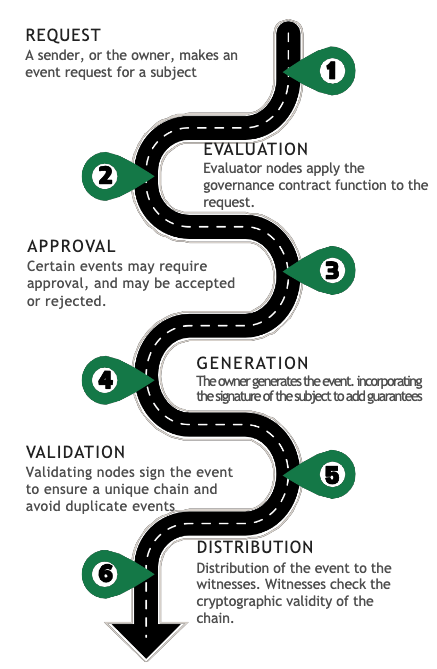

## Ciclo de vida

La **gobernanza** determina el procolo por el que los eventos son incorporados al ciclo de vida del sujeto de trazabilidad

 

## Tipos de eventos
| Evento    | Descripción                                                                                               |
|-----------|-----------------------------------------------------------------------------------------------------------|
| Start     | Inicializa el registro de eventos de un sujeto, estableciendo a los participantes y la **gobernanza** del libro contable. |
| State     | Los registros de estado cambian las propiedades del sujeto, por lo que su estado se modifica.             |
| Fact      | Hechos relacionados con la función o el entorno del sujeto pero que no modifican sus propiedades.         |
| Transfer  | Transfiere la propiedad del sujeto a un nuevo propietario. Ocurre una rotación de clave para evitar la manipulación de eventos anteriores por el nuevo propietario. |
| EOL       | Evento de fin de vida que finaliza el registro de eventos, evitando nuevas adiciones.                     |

En cuanto a la estructura y los contenidos de los actos, nos hemos basado en soluciones de diseño reconocidas por la industria [^1]. El enfoque habitual es estructurar el evento en una cabecera, con una estructura común para todos los eventos, incluyendo sus metadatos, y una carga útil con información específica para cada evento.

## Ejemplo
Diagrama generado un evento tipo **Fact**.

Diagrama generado un evento tipo **State**.

Diagrama generado un evento tipo **EOL**.

## Referencias
[^1]: Event Processing in Action - Opher Etzion y Peter Niblett (2010). Manning Publications Co., 3 Lewis Street Greenwich, Estados Unidos. ISBN: 978-1-935182-21-4.