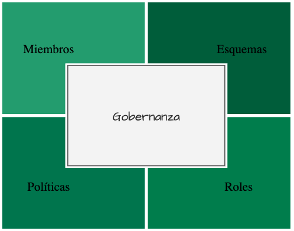

La **gobernanza** es el conjunto de definiciones y reglas que establecen cómo los diferentes nodos participantes en una red se relacionan con los sujetos de la trazabilidad e interaccionan entre si. Los componentes de las **gobernanza** son:

- Los nodos participantes.
- El esquema de los atributos de los sujetos.
- El contrato para aplicar los eventos que modifican el estado del sujeto.
- Los permisos de cada participante para participar en la red.

## Miembros
Estas son las personas, entidades u organizaciones que participan en la **gobernanza** y por tanto pueden ser parte de los casos de uso que se soportan. Cada miembro declara un identificador único que representa el material criptográfico con el que operará en la red, su identidad .
## Esquemas
Los **esquemas** son las estructuras de datos que modelan la información almacenada en los **sujetos**. Dentro de una **gobernanza**, se pueden definir diferentes **esquemas** para admitir diferentes casos de uso. Cuando se crea un sujeto, define a qué gobierno está asociado y qué esquema utilizará. Además, cada esquema tiene asociado un **contrato inteligente** que permitirá modificar el estado de los sujetos.
## Roles
Los **roles** representan grupos de participantes con algún tipo de interés común en un conjunto de sujetos. Los **roles** nos permiten asignar permisos sobre estos grupos de sujetos más fácilmente que si tuviéramos que asignarlos individualmente a cada miembro del gobierno.
## Políticas
Las **políticas** definen las condiciones específicas bajo las cuales se afecta el ciclo de vida de un evento, como el número de firmas necesarias para llevar a cabo los procesos de evaluación, aprobación y validación. A esto se le llama quórum.
La configuración de **gobernanza** permite la definición de [distintos tipos de quórum] , más o menos restrictivos, dependiendo de la necesidad del caso de uso.

## La gobernanza como sujeto
La **gobernanza** es un sujeto de trazabilidad, dado que puede evolucionar y adaptarse a las necesidades de negocio, y por tanto su ciclo de vida también esta determinado por una **gobernanza**, lo que dota a nuestra infraestructura de transparencia y confianza para todos los participantes.