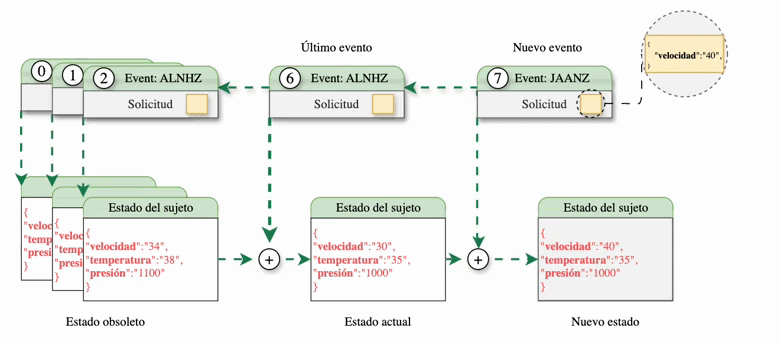

En lugar de tener un único libro de contabilidad compartido por todos los participantes, la información se estructura sujeto por sujeto. Los sujetos son entidades lógicas que representan un activo o proceso dentro de una red

Cada sujeto cumple con lo siguiente:
- Contiene un único [microledger](#microledger).
- Tiene un [estado](#estado-del-sujeto) modelado por un esquema.
- Tiene un solo [dueño](#modelo-de-propiedad)
- Depende de una [gobernanza](#pertenecer-a-una-gobernanza).

## Microledger
Cada sujeto contiene internamente un libro de contabilidad en el que se registran los eventos que afectan únicamente a ese sujeto, el **microledger**. Este **microledger** es un conjunto de eventos encadenados mediante mecanismos criptográficos. Es similar a una blockchain en que los diferentes elementos de la cadena se relacionan incluyendo la huella criptográfica del elemento inmediatamente anterior, pero, a diferencia de las blockchains en las que cada bloque puede incluir un conjunto de transacciones, posiblemente de diferentes cuentas, en el **microledger**. cada elemento representa un único evento del propio sujeto.

{}
{}

## Estado del Sujeto
El estado es la representación de la información almacenada por un sujeto en un instante determinado, normalmente el momento actual. El estado se obtiene aplicando, uno tras otro, los diferentes eventos del **microledger** sobre el estado inicial del sujeto definido en su **evento-génesis**. 

La estructura del estado debe corresponder a un esquema válido. Para obtener más información sobre los esquemas, visite la página [Esquemas](../schema).

A diferencia de otras DLT, Kore no tiene tablas de datos. La información se almacena en una sola entidad, el estado sujeto. Esta entidad debe representar únicamente el estado final de nuestro sujeto, mientras que los detalles de los diferentes eventos se almacenarán en el microledger.

## Modelo de propiedad
Cualquier sujeto tiene un único propietario, siendo este el único participante de la red que puede realizar modificaciones efectivas sobre el sujeto, es decir, agregar eventos en el **microledger**. Sin embargo, otros participantes, los emisores, pueden generar solicitudes de eventos. Estas solicitudes de eventos son firmadas por el emisor y enviadas al propietario del sujeto.

## Pertenecer a una gobernanza
Un sujeto siempre existe dentro de un caso de uso. La gobernanza es la definición de las reglas por las que se rige el caso de uso. Qué tipos de sujetos se pueden crear o quién puede crearlos son algunas de las reglas que se definen en la gobernanza. Aunque un sujeto sólo puede pertenecer a una gobernanza, un nodo puede gestionar sujetos de diferente gobernanza, de modo que un mismo nodo pueda participar simultáneamente en diferentes casos de uso.

### Espacio de nombres 
Cuando se crea un sujeto, se le asocia cierta información, como la gobernanza, el esquema y un espacio de nombres. El espacio de nombres está asociado con el caso de uso y la gobernanza, ya que es el mecanismo mediante el cual se pueden segmentar las partes interesadas. En el mismo caso de uso, no todos los participantes pueden estar interesados ​​en todos los sujetos, sino sólo en un subconjunto de ellos.

## Identificador del sujeto y claves
A cada sujeto, en el momento de su creación, se le asigna un par de claves criptográficas con las que firmar los eventos de su microledger. A partir de la clave pública y otros metadatos se genera su **Identificador de Asunto** (subjectId) , que lo representa de forma única en la red.